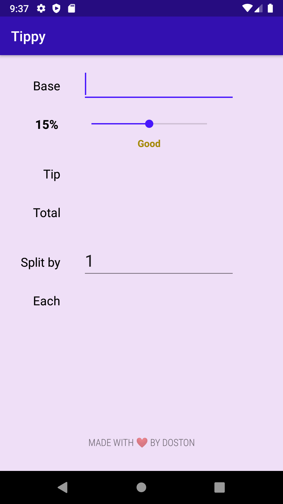
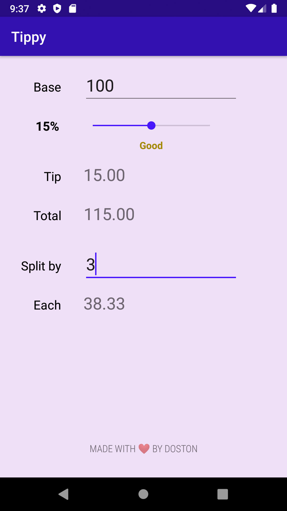
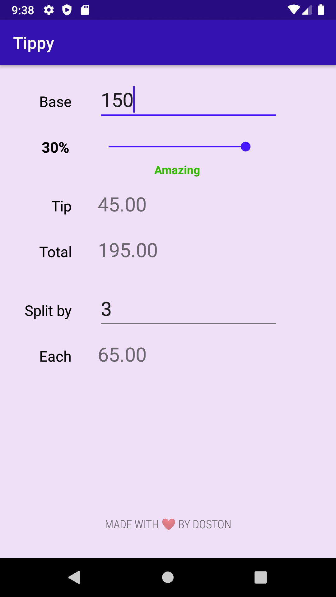

# Tippy
*Simple Android app that, given an input, lets users calculate a tip for the service at restaurants, cafe, etc. Users also have an option to split the bill by a number of people.*

Download it on Google Play:

Screenshots:

  

*Special thanks to <a href="https://www.youtube.com/user/rpandey1234" target="_blank">Rahul Pandey</a> for his amazing courses*
